# 📊 PrescripCare Database Schema Diagram

## Entity Relationship Diagram

```mermaid
erDiagram
    %% User Management
    users {
        uuid user_id PK
        varchar email UK
        varchar password_hash
        varchar salt
        boolean email_verified
        enum account_status
        boolean two_factor_enabled
        timestamp created_at
        timestamp updated_at
        timestamp last_login
    }

    user_profiles {
        uuid profile_id PK
        uuid user_id FK
        varchar first_name
        varchar last_name
        date date_of_birth
        enum gender
        varchar phone_number
        integer height_cm
        decimal weight_kg
        decimal bmi
        enum blood_type
        varchar timezone
        json notification_preferences
    }

    user_medical_conditions {
        uuid condition_id PK
        uuid user_id FK
        varchar condition_name
        varchar condition_code
        enum severity
        date diagnosed_date
        enum status
        text notes
    }

    user_allergies {
        uuid allergy_id PK
        uuid user_id FK
        varchar allergen_name
        enum allergen_type
        enum reaction_severity
        text reaction_symptoms
        boolean verified_by_doctor
    }

    %% Drug Master Data
    drugs_master {
        uuid drug_id PK
        varchar drug_name
        varchar generic_name
        json brand_names
        varchar drug_class
        varchar therapeutic_category
        json active_ingredients
        json available_strengths
        json dosage_forms
        text indications
        text contraindications
        json side_effects
        boolean fda_approved
    }

    drug_interactions {
        uuid interaction_id PK
        uuid drug_a_id FK
        uuid drug_b_id FK
        enum interaction_type
        varchar mechanism
        text clinical_effect
        text management_strategy
        enum evidence_level
        integer severity_score
    }

    drug_food_interactions {
        uuid interaction_id PK
        uuid drug_id FK
        varchar food_item
        enum interaction_type
        text description
        text recommendation
    }

    %% User Medications
    user_medications {
        uuid medication_id PK
        uuid user_id FK
        uuid drug_id FK
        varchar prescription_number
        varchar prescriber_name
        varchar strength
        varchar dosage_form
        integer quantity_prescribed
        integer refills_remaining
        varchar dosing_frequency
        json dosing_schedule
        text instructions
        date start_date
        date end_date
        enum status
        decimal adherence_target
    }

    medication_schedules {
        uuid schedule_id PK
        uuid medication_id FK
        time dose_time
        varchar dose_amount
        varchar special_instructions
        boolean is_active
    }

    %% Dose Tracking
    dose_events {
        uuid event_id PK
        uuid user_id FK
        uuid medication_id FK
        uuid schedule_id FK
        timestamp scheduled_datetime
        timestamp actual_datetime
        enum status
        varchar dose_amount_taken
        boolean taken_with_food
        text side_effects_noted
        text notes
        enum recorded_via
    }

    adherence_summaries {
        uuid summary_id PK
        uuid user_id FK
        uuid medication_id FK
        enum period_type
        date period_start
        date period_end
        integer total_scheduled_doses
        integer doses_taken
        integer doses_missed
        decimal adherence_percentage
        integer current_streak_days
    }

    %% Notifications
    notification_preferences {
        uuid preference_id PK
        uuid user_id FK
        boolean medication_reminders
        boolean missed_dose_alerts
        boolean refill_reminders
        boolean push_notifications
        boolean email_notifications
        boolean sms_notifications
        integer reminder_advance_minutes
        time quiet_hours_start
        time quiet_hours_end
    }

    notification_queue {
        uuid notification_id PK
        uuid user_id FK
        enum notification_type
        varchar title
        text message
        timestamp scheduled_for
        enum delivery_method
        enum priority
        enum status
        timestamp sent_at
        uuid related_medication_id FK
    }

    notification_history {
        uuid history_id PK
        uuid notification_id FK
        uuid user_id FK
        enum delivery_method
        enum delivery_status
        timestamp delivered_at
        timestamp opened_at
        timestamp clicked_at
        varchar action_taken
    }

    %% Healthcare Providers
    healthcare_providers {
        uuid provider_id PK
        varchar first_name
        varchar last_name
        varchar title
        varchar specialty
        varchar npi_number UK
        varchar practice_name
        varchar phone_number
        varchar email
        boolean is_active
        boolean verified
    }

    user_provider_relationships {
        uuid relationship_id PK
        uuid user_id FK
        uuid provider_id FK
        enum relationship_type
        boolean is_primary
        date start_date
        date end_date
        enum status
        boolean can_view_medications
        boolean can_prescribe
    }

    %% Health Analytics
    health_metrics {
        uuid metric_id PK
        uuid user_id FK
        enum metric_type
        decimal metric_value
        varchar unit
        timestamp recorded_at
        text notes
        enum recorded_via
        boolean is_verified
    }

    lifestyle_goals {
        uuid goal_id PK
        uuid user_id FK
        enum goal_type
        varchar goal_name
        text description
        decimal target_value
        varchar target_unit
        decimal current_value
        date start_date
        date target_date
        enum status
        decimal completion_percentage
    }

    %% Pharmacy & Insurance
    pharmacies {
        uuid pharmacy_id PK
        varchar pharmacy_name
        varchar chain_name
        enum pharmacy_type
        varchar phone_number
        varchar address_line1
        varchar city
        varchar state_province
        varchar postal_code
        json hours_of_operation
        json services_offered
        boolean is_active
    }

    user_insurance {
        uuid insurance_id PK
        uuid user_id FK
        varchar insurance_company
        varchar plan_name
        varchar policy_number
        decimal copay_amount
        decimal deductible_amount
        date effective_date
        date expiration_date
        boolean is_primary
        boolean is_active
    }

    %% Security & Audit
    audit_logs {
        uuid log_id PK
        uuid user_id FK
        varchar action_type
        varchar table_name
        uuid record_id
        json old_values
        json new_values
        timestamp performed_at
        inet ip_address
        varchar user_agent
        enum risk_level
    }

    session_management {
        varchar session_id PK
        uuid user_id FK
        timestamp created_at
        timestamp last_activity
        timestamp expires_at
        inet ip_address
        varchar user_agent
        boolean is_active
    }

    %% Relationships
    users ||--|| user_profiles : has
    users ||--o{ user_medical_conditions : has
    users ||--o{ user_allergies : has
    users ||--o{ user_medications : prescribes
    users ||--o{ dose_events : records
    users ||--|| notification_preferences : configures
    users ||--o{ notification_queue : receives
    users ||--o{ health_metrics : tracks
    users ||--o{ lifestyle_goals : sets
    users ||--o{ user_insurance : covered_by
    users ||--o{ audit_logs : generates
    users ||--o{ session_management : maintains

    drugs_master ||--o{ user_medications : prescribed_as
    drugs_master ||--o{ drug_interactions : interacts_with_a
    drugs_master ||--o{ drug_interactions : interacts_with_b
    drugs_master ||--o{ drug_food_interactions : has

    user_medications ||--o{ medication_schedules : scheduled_as
    user_medications ||--o{ dose_events : tracked_in
    user_medications ||--o{ adherence_summaries : summarized_in

    medication_schedules ||--o{ dose_events : generates

    healthcare_providers ||--o{ user_provider_relationships : serves_in

    notification_queue ||--o{ notification_history : tracked_in
```



## Database Size Estimates

### Storage Requirements (Projected for 1 Million Users)

| Table | Est. Rows | Avg Row Size | Total Size |
|-------|-----------|--------------|------------|
| users | 1M | 500B | 500MB |
| user_profiles | 1M | 1KB | 1GB |
| user_medications | 5M | 800B | 4GB |
| dose_events | 500M | 600B | 300GB |
| adherence_summaries | 50M | 400B | 20GB |
| drugs_master | 100K | 2KB | 200MB |
| drug_interactions | 500K | 800B | 400MB |
| notification_queue | 10M | 600B | 6GB |
| notification_history | 100M | 400B | 40GB |
| audit_logs | 1B | 800B | 800GB |
| **Total Estimated** | | | **~1.2TB** |

### Index Size Estimates
- Primary Key Indexes: ~50GB
- Foreign Key Indexes: ~30GB
- Search Indexes: ~20GB
- Composite Indexes: ~40GB
- **Total Index Size**: ~140GB

## Performance Optimization Strategy

### Partitioning Strategy
```sql
-- Partition dose_events by month (most queried table)
CREATE TABLE dose_events_2025_01 PARTITION OF dose_events 
FOR VALUES FROM ('2025-01-01') TO ('2025-02-01');

-- Partition audit_logs by quarter
CREATE TABLE audit_logs_2025_q1 PARTITION OF audit_logs 
FOR VALUES FROM ('2025-01-01') TO ('2025-04-01');
```

### Archival Strategy
```sql
-- Archive dose_events older than 2 years to separate tables
-- Keep audit_logs for 7 years for compliance
-- Archive notification_history older than 1 year
```

### Read Replicas
- **Primary**: Write operations, real-time queries
- **Analytics Replica**: Reporting and analytics queries
- **Backup Replica**: Disaster recovery

## Scaling Considerations

### Horizontal Scaling
1. **User Sharding**: Partition users by geography or user_id ranges
2. **Time-based Sharding**: Separate current vs historical data
3. **Service Decomposition**: Separate notification service, analytics service

### Caching Strategy
```redis
# Cache frequently accessed data
user:profile:{user_id} -> JSON (TTL: 1 hour)
user:medications:{user_id} -> JSON (TTL: 30 minutes)
drug:info:{drug_id} -> JSON (TTL: 24 hours)
dose:today:{user_id} -> JSON (TTL: 1 hour)
adherence:summary:{user_id}:{period} -> JSON (TTL: 6 hours)
```

## Data Compliance & Security

### HIPAA Compliance Requirements
- **Encryption at Rest**: All tables encrypted using AES-256
- **Encryption in Transit**: TLS 1.3 for all connections
- **Access Logging**: Complete audit trail in audit_logs table
- **Data Minimization**: Store only necessary health information
- **User Consent**: Track consent in user_profiles.notification_preferences

### GDPR Compliance
- **Right to Access**: Complete user data export functionality
- **Right to Rectification**: Profile update capabilities
- **Right to Erasure**: Hard delete with cascade operations
- **Data Portability**: JSON export format
- **Consent Management**: Granular notification preferences

### Backup Strategy
```bash
# Daily incremental backups
mysqldump --single-transaction --routines --triggers prescripcare > backup_$(date +%Y%m%d).sql

# Weekly full backups to cloud storage
# Point-in-time recovery capability
# Cross-region backup replication
```

This comprehensive database blueprint provides a solid foundation for a scalable, secure, and compliant prescription management system capable of handling millions of users and their health data.